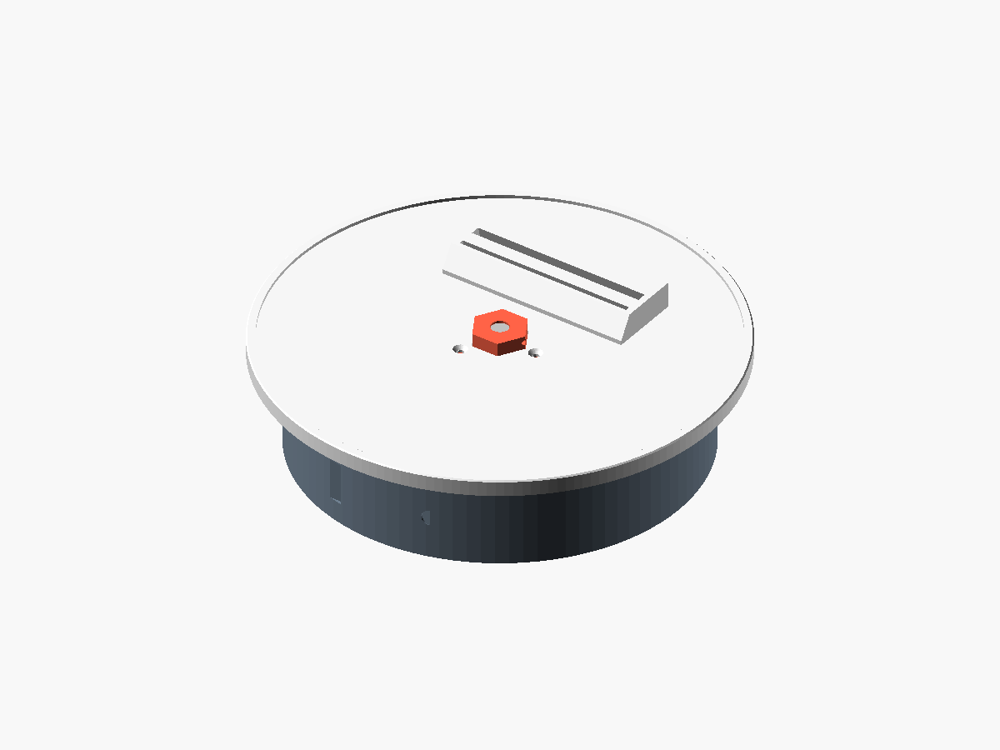

# 3d-designer-skill

An agentic **plan → build → inspect → learn** workflow for parametric 3D design, packaged as a
[Claude Code](https://claude.ai/code) skill with four specialised sub-agents, a Python pipeline that
compiles and checks OpenSCAD models, multi-format export, and a knowledge base that learns from every job.

The first project built with it is a **slim, 12 V worm-gear-driven turntable for a Whatnot card auction**
(spin/hold switch, 2–5 RPM knob) — see [`projects/whatnot-turntable`](projects/whatnot-turntable).



## How it works

```
 "design me a ..." ──► design-planner ──► design-builder ──► design-inspector ──┬─ PASS ─► export ─► design-learner
                        (plan.json)        (model.scad)        (findings)       │
                                              ▲                                 │ FAIL (≤ 3 rounds)
                                              └─────────────────────────────────┘
```

| Phase | Agent | Script | Produces |
|---|---|---|---|
| Plan | `design-planner` | `designer plan` | `plan.json`: hardware + critical dims, mechanism math, parts + print orientation, steps with `done_when`, checks |
| Build | `design-builder` | `designer build` | `.scad` model using `lib/`, compiled STLs, `CHECK` values, BOM / wiring / assembly docs |
| Inspect | `design-inspector` | `designer inspect` | watertightness, bed fit, overhang %, thin fragments, **interference between assembled parts**, plan assertions, renders → ranked findings |
| Export | — | `designer export` | STL, 3MF, OBJ, GLB, PLY, OFF, AMF, SVG/DXF outlines, PNG views |
| Learn | `design-learner` | `designer learn` / `stats` | metrics per run, tagged lessons, reinforced weights, tuned defaults |

The learner's output feeds the next planner run: lessons whose tags match the new spec are injected into
`plan.json["applied_lessons"]`, lessons that led to passing builds gain weight, and the constraint defaults
drift toward what has worked. Phase timings are kept so slow phases are visible (`designer stats`).

## Quick start

```bash
git clone <this repo> && cd 3d-designer-skill
bash scripts/setup.sh                              # openscad, trimesh, shapely; checks xvfb for headless renders

# run the sample project end to end
python -m designer run projects/whatnot-turntable  # plan → build → inspect → export → metrics
open projects/whatnot-turntable/build/export/       # STL/3MF/OBJ/GLB/SVG/PNG

# start a new design
python -m designer new projects/phone-stand --name "Phone stand"
$EDITOR projects/phone-stand/spec.md               # goal, requirements, tags, print bed
```

In Claude Code, just ask: *"/3d-designer design me a wall bracket for a 40 mm fan"* — the skill runs the
loop with the four agents in `.claude/agents/`.

## Repository layout

```
.claude/skills/3d-designer/SKILL.md   the orchestration skill (what Claude does, in what order)
.claude/agents/design-*.md            planner / builder / inspector / learner sub-agents
designer/                             python pipeline  (python -m designer --help)
  planner.py builder.py inspector.py exporter.py learner.py cli.py
  knowledge/  lessons.json lessons.md heuristics.json metrics.jsonl   ← adaptive memory
lib/gears.scad                        involute spur gears + helpers
lib/hardware.scad                     envelopes of off-the-shelf parts (JGY-370, 608, panel parts)
templates/                            spec / plan / model scaffolds for `designer new`
projects/whatnot-turntable/           the turntable: spec, plan, model, BOM, wiring, assembly, build/
docs/                                 ARCHITECTURE.md, EXPORT_FORMATS.md
```

## The turntable at a glance

| | |
|---|---|
| Plate | Ø210 × 6 mm, raised rim, removable (one grub screw); optional two-piece print |
| Base | Ø180 × 42 mm, PETG; motor, PWM board, switch, pot and jack inside |
| Drive | JGY-370 12 V worm-gear motor 15 RPM → 17T/51T printed spur pair (3:1) → Ø8 steel rod in 2 × 608 bearings |
| Speed | 2–5 RPM from the panel knob (PWM); rocker switch = spin / hold. Worm gear self-locks when off |
| Cost | ≈ $30–40 in parts + ~350 g filament |

Files: [`turntable.scad`](projects/whatnot-turntable/turntable.scad) · [`BOM.md`](projects/whatnot-turntable/BOM.md) ·
[`wiring.md`](projects/whatnot-turntable/wiring.md) · [`assembly.md`](projects/whatnot-turntable/assembly.md) ·
[`build/inspection.md`](projects/whatnot-turntable/build/inspection.md)

## Requirements
Python ≥ 3.10, OpenSCAD ≥ 2021.01 (`openscad` on PATH), `pip install -r requirements.txt`.
Headless PNG renders need `xvfb-run` on Linux (`apt install xvfb`); on macOS/Windows OpenSCAD renders directly.

## License
MIT — see [LICENSE](LICENSE).
